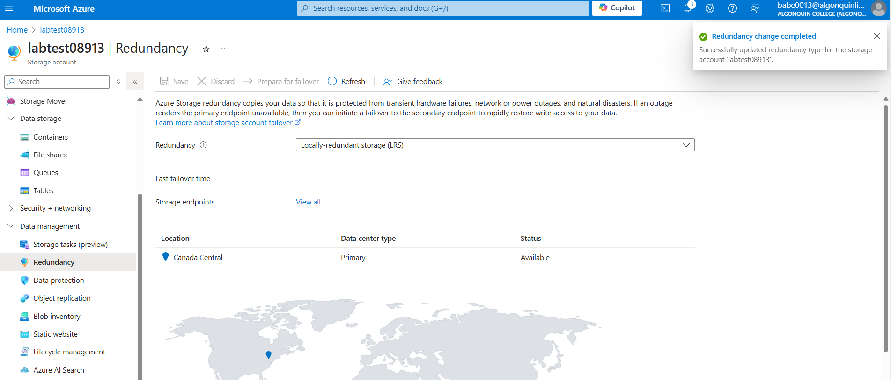
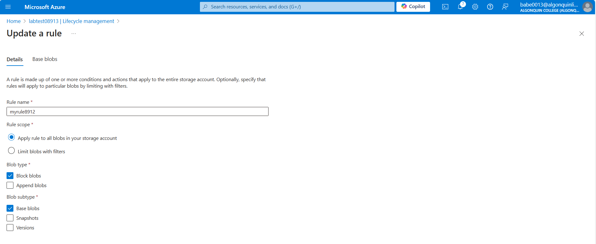

# CST8912 - Cloud Solution Architecture

## Cloud Development and Operations

### CST8912_013 Cloud Solution Architecture 

##### Graded Lab Activity 3, Week 4

---

**Prepared By:**
Thoufeek Baber (041166788)

**Submitted to:**
Prof. Ragini Madaan

---

## Goal of this project:

Compose the appropriate networking, compute, storage, and database services to meet the operational requirements of various application scenarios. 

- **Design cloud architecture layers** and their function to maximize reliability and resiliency of application services.
  
- **Outline core architectural components** to meet the operational requirements of various application scenarios.
  
- **Describe cloud service models** (IaaS, PaaS, SaaS) and implement highly available and elastically scalable solutions.
  
- **Identify the core features of cloud computing** and their interactions with each service layer.

### Steps:

**1. Creating a storage account** - Create a storage account named `labtest8912` under student subscription and resource group `CST8912-demo` for region Canada central and select geo redundant storage **(geo redundant storage GRS)**, keep networking and data protection options default.

 
  *Figure 1: Image shows the overview of Resource Group ‘CST8912-demo’*

 
 *Figure 2: Image shows the overview of the storage labtest08913.*

**2. Change Redundancy** - Go to your storage account resource blade, in data management section, go to redundancy tab and change redundancy to `local redundant storage` from dropdown, and under settings choose configuration and set blob access tier to `cool` and save the change.

*Figure 3: Image shows Redundancy set to local redundant storage.*

*Figure 4: Change configuration Blob access tier to Cool*

**3. Creation of containers** - Under data storage left, click containers and add new container named `labtestcontainer8912` and select upload a blob and change the advance settings and change the access tier to `hot` and upload to folder named `sampletest8912`, browse the files from the sample files links shared in this lab (check with your instructor if you cannot find the sample file link)

*Figure 5: Shows the overview of the Storage account created for this project.*

*Figure 6: Shows the overview of labtestcontainer8912 created for the project.*

*Figure 7: Shows the uploaded file/folder in the container.*

**4. Accessing file thorugh public domain** - Click the file uploaded in the container to see the configuration options and copy the blob url and open a new *private window* from the browser to paste the copied url 
note : The url should not work since the containers public access is set to private, resource was not found.  

*Figure 8: Failed to access the file due to lack of access token*

**5. Creation of SAS Token** - On the file blade, click generate SAS and copy the SAS token generated and paste the blob SAS URL on the private window of the browser, you must be able to see the file.

*Figure 9: Shows the creation of SAS token for public domain access*

*Figure 10: Image shows the successful download of the file using the SAS URL link.*

**6. Rule Creation** - On the container blade under data management tab go to `Lifecycle Management` and create a new rule name `myrule8912`, rule scope should be `limit blobs with filters` and blob type and blob subtype should be default, add condition if base blobs were last modified more than “15 days” ago then `move to cool storage`.

*Figure 11: Creation of rule name “myrule8912”.*

*Figure 12: Shows details tab of the created Rule.*

*Figure 13: image shows the settings move to cool storage after 15 days.*

**7. Deleting Resources** - After demo delete all the resources created during lab and create a lab report documenting all the steps with screenshots.

*Figure 14: Shows the complete deletion of all the resources created for the project.*